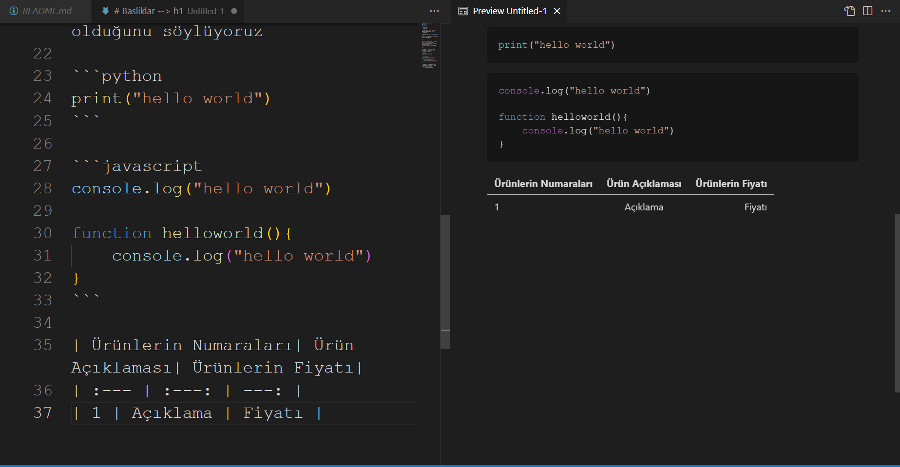

# Kodluyoruz Ilk Repo
Bu repo [Kodluyoruz](https://kodluyoruz.org/) Front-End Eğitiminde oluşturduğumuz ilk repo. İçerisinde bir adet README dosyası, bir adet index.html barındırıyor.



## Installation
Öncelikle projeyi clonelayın.

```
git clone https://github.com/EnesAGCA/kodluyoruzilkrepo.git
``` 
## Usage
Projeyi cloneladıktan sonra Visual Studio Code programını açınız.

Windows için:
```
git cd kodluyoruzilkrepo
code .
```
## Contributing
Pull requestler kabul edilir. Büyük değişiklikler için, lütfen önce neyi değiştirmek istediğinizi tartışmak için bir konu açınız.
## Licence
[MIT](https://choosealicense.com/licenses/mit/)